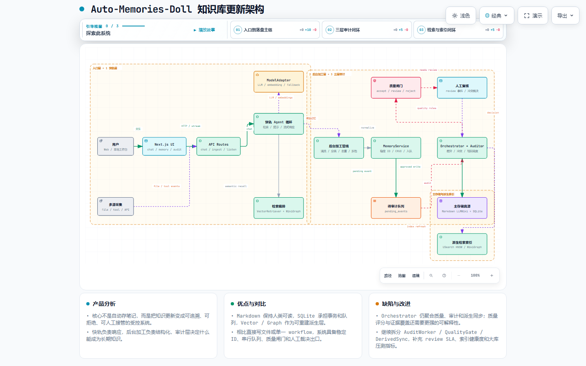

# Auto-Memories-Doll

**和 AI 聊了 30 轮，它忘了你第 1 轮说的重要东西？这个工具在后台自动把你的对话归类整理成笔记，下次聊天时自动检索回来。**

[English](#english) · [快速开始](#快速开始) · [功能](#功能) · [架构](#架构) · [开发](#开发)

---

## 为什么需要这个

你正在学一门新技术，和 AI 聊了一下午。第二天打开对话，它不记得昨天讨论过什么了。ChatGPT 的 Memory 只能记住一些零碎的事实，不会帮你系统地整理知识。

Auto-Memories-Doll 做的事情很简单：

```
你和 AI 的对话（散落在各个工具里）
        ↓ 自动采集
  后台按话题归类整理
        ↓ 自动生成
  结构化的 Markdown 笔记
        ↓ 下次聊天时
  自动检索相关记忆注入上下文
```

不是黑盒数据库，不是云端的 API。你的知识就是一个个 Markdown 文件，存在你自己电脑上，用任何编辑器都能打开看。

## 适合谁

- **学生** — 和 AI 讨论作业、论文、课程，自动整理成按话题分类的笔记库
- **开发者** — 和编程助手的对话自动归档，下次遇到类似 bug 时自动关联之前的解法
- **知识工作者** — 散落在 Trae、Cursor、ChatGPT 里的对话汇总到一个地方，统一管理

## 快速开始

### 前置要求

- Node.js >= 22
- 一个 AI API Key（支持 OpenAI 兼容接口：智谱 GLM、DeepSeek、OpenAI 等）

### 三步启动

```bash
# 1. 安装依赖
npm install

# 2. 配置环境变量
cp .env.example .env.local
# 编辑 .env.local，至少填入 MODEL_API_KEY

# 3. 启动
npm run dev
```

打开 `http://localhost:3000`，开始对话。

应用默认只绑定本机 `127.0.0.1`，API 也会拒绝非本机 Host 请求。远程或局域网暴露当前不受支持，请不要把启动参数改为 `0.0.0.0` 后直接公开使用；本机工具应通过 `localhost` 或 `127.0.0.1` 调用 API。

### 环境变量示例

```env
# 用智谱 GLM（新用户有免费额度）
MODEL_BASE_URL=https://open.bigmodel.cn/api/paas/v4
MODEL_API_KEY=你的key
FLAGSHIP_MODEL=glm-5.2
STANDARD_MODEL=glm-4-flash
BUDGET_MODEL=glm-4-flash
EMBEDDING_MODEL=embedding-3

# 或用 DeepSeek
MODEL_BASE_URL=https://api.deepseek.com/v1
MODEL_API_KEY=你的key
FLAGSHIP_MODEL=deepseek-chat
```

## 功能

### 自动采集：对话从哪来都行

| 来源 | 怎么接 | 说明 |
|------|--------|------|
| 内置对话 | 首页点击「开始对话」 | 带记忆检索的 AI 对话 |
| Trae IDE / 浏览器 AI | `POST /api/listen` | 对话完成后自动推送 |
| Cursor / Codex / Claude Code | 设置里添加目录监听 | 自动解析会话文件 |
| 本地 Markdown 文件 | 放入 `memory-root/` | 文件变化自动导入 |
| Chrome / Edge | 定时采集（默认关） | 浏览记录和书签自动总结 |

### 自动归类：7 个话题分类

对话内容自动按关键词分到对应目录：

| 话题 | 举例 |
|------|------|
| AI 编程 | 代码、React、API、bug、算法 |
| 学习笔记 | 学习、教程、笔记、总结 |
| 项目规划 | 项目、需求、架构、roadmap |
| 日常记录 | 日记、今天、心情 |
| 会议记录 | 会议、讨论、决策 |
| 阅读摘录 | 论文、书籍、paper |
| 灵感想法 | 想法、灵感、brainstorm |

归类结果就是文件夹：`notes/ai-coding/`、`notes/learning/`……你可以直接打开看。

### 自动整理：摘要、标签、关联

每条记忆自动生成：

- **标题和摘要** — 从对话中提取关键信息
- **标签** — 自动提取 `#tag`、`@tag`、`[tag]`
- **知识关联** — 通过 `[[wikilink]]` 建立记忆之间的关系
- **热度评分** — 常访问的、最近更新的笔记排在前面

### 自动检索：下次聊天时自动召回

新对话开始时，系统自动：

1. 多路召回：原句 + 改写变体并行检索（改写失败自动退回单路）
2. 用向量搜索找到语义相关的记忆
3. 用 MMR 重排保证多样性（不召回一堆相似内容）
4. 按命中的记忆 ID 精确加载，通过图谱扩展找到关联记忆
5. 注入到 AI 的上下文中

AI 在第 N 轮对话时，仍然记得第 1 轮讨论过什么。

### 记忆纠错：发现记错了可以直接改

对话里说"你记错了，XXX 其实是 YYY"，系统会定位到那条记忆、按你的说法改写，并把改动走审计队列落库（打上 `corrected` 标签，可追溯）。模型不可用时拒绝改写，不会污染笔记。

### 审计安全：不会意外覆盖你的笔记

所有记忆写入都经过审计队列：

- 候选内容先排队，不直接写入
- 自动检测冲突（新旧内容矛盾时不盲目覆盖）
- 前端审计面板让你决定接受还是保留原版

### 降级保护

- API 挂了 → 自动切换本地检索模式
- Embedding 不可用 → 降级为关键词搜索
- 恢复后自动退出降级，前端全程可见状态

## 接入外部工具

### 通过 API 推送对话

```bash
curl -X POST http://localhost:3000/api/listen \
  -H "Content-Type: application/json" \
  -d '{
    "source": "trae-ide",
    "messages": [
      {"role": "user", "content": "帮我实现快速排序"},
      {"role": "assistant", "content": "这是快速排序的实现..."}
    ],
    "metadata": {"platform": "Trae IDE", "model": "claude-sonnet"}
  }'
```

返回自动归类的话题、生成的摘要和标签。

请求失败时统一返回以下结构，`error.code` 可用于调用方区分错误类型：

```json
{
  "success": false,
  "error": {
    "code": "VALIDATION_FAILED",
    "message": "具体错误"
  }
}
```

### 监听本地工具目录

在设置页面（`/settings/tools`）添加 Cursor、Codex CLI 或 Claude Code 的工作目录，新会话文件自动解析导入。

### 浏览器书签脚本

`public/bridge/capture.js` 可作为浏览器书签，一键捕获当前 AI 聊天页面并推送。

## 存储结构

```
memory-root/
├── memory.db              # SQLite（向量索引、审计队列、冲突记录）
├── profile.md             # 用户画像
├── notes/                 # 笔记（按话题分目录）
│   ├── ai-coding/
│   │   ├── Agent.md       # 该话题的摘要
│   │   └── note-*.md      # 具体笔记（YAML frontmatter + 正文）
│   ├── learning/
│   └── project-planning/
└── archive/               # 归档和历史版本
```

笔记是纯 Markdown 文件。你可以用 VS Code、Obsidian、甚至记事本打开编辑。

## 架构

最终版交互式结构图：

[打开知识库更新架构图](结构图/knowledge-architecture.architecture.html)



系统按“入口 → 快轨 → 后台加工 → 三层审计 → 主存储/派生索引”组织。候选记忆不会直接写入长期知识库，而是先进入待审计队列，再经过质量判断、人工复核和差异审计：

```
用户输入 → 意图分类（关键词→语义→LLM 三级级联）
         → 记忆检索（向量 + 关键词 + 图谱）
         → 组装 prompt → AI 流式响应 → 工具调用循环
         → 候选记忆入待审计队列
         → 质量闸门（accept / review / reject）
         → 人工复核与冲突裁决
         → Orchestrator + Auditor 差异比对
         → Markdown 真源写回 → Vector / Graph 派生索引刷新
```

| 层 | 职责 | 关键模块 |
|----|------|----------|
| 入口层 | 用户交互、多源输入和 API 接入 | `src/app/`, `src/components/`, `src/app/api/` |
| 1 快轨层 | 记忆检索、提示组装、Agent 循环和流式响应，只产生候选 | `src/features/chat/handler.ts`, `src/lib/ai/` |
| 2 后台加工层 | 清洗、分类、去重、结构化和待审计事件生成 | `src/features/ingest/`, `src/server/pipelines/`, `MemoryService` |
| 3 质量闸门 | 按规则将候选分为接受、人工复核或拒绝 | `src/features/audit/auditor.ts`, `differ.ts` |
| 3 人工复核 | 处理 review 事件、冲突和人工裁决 | `src/features/audit/reviewer.ts`, `src/components/audit/`, `src/app/api/audit/` |
| 3 审计中枢 | 差异比对、版本校验、写回调度和失败重试 | `src/server/services/orchestrator.ts`, `src/server/workers/audit-worker.ts` |
| 主存储真源 | 保存 Markdown LLMWiki、SQLite 队列、版本和冲突记录 | `memory-root/`, `src/lib/storage/` |
| 派生检索索引 | 从真源重建向量 ANN、关键词和 wikilink 图谱索引 | `src/lib/vector/`, `src/lib/graph/` |

技术栈：TypeScript / Next.js 14 / React 18 / Vercel AI SDK / SQLite / HNSW 向量索引 / Tailwind CSS

## 开发

```bash
npm run typecheck    # 类型检查
npm run lint         # 严格 Lint（0 warning）
npm test             # 运行单元/集成测试（44 文件，413 用例）
npm run test:coverage # 覆盖率门禁（Lines 30% / Branches 70% / Functions 50%）
npm run eval         # 检索评测（Recall@k / MRR 报告）
npm run format:check # 格式检查
npm run format       # 格式化代码
npm run build        # 生产构建
npm run test:e2e     # 真实浏览器门禁（需先安装 Chromium）
```

Playwright E2E 使用 `e2e/.tmp/` 下的隔离 memory root 和数据库，测试结束后不会读取或写入真实 `memory-root/`。首次运行可执行 `npx playwright install chromium` 安装本地测试浏览器。

## 项目状态

个人学习项目，v0.1 阶段。核心链路已跑通，持续改进中。

**已完成：** Agent 循环 · 记忆审计管线 · HNSW 向量检索 · 关键词降级 · MMR 重排 · 多路召回（query 改写）· 记忆纠错闭环 · 检索评测（Recall@k/MRR）· GitHub Actions CI · 多源采集 · 会话持久化 · 上下文压缩 · 降级恢复 · loopback 安全边界 · 真实 Playwright E2E · 413 个测试用例

**计划中：** Electron 桌面封装 · 评测集扩充与参数调优 · 会话树形分支

## License

MIT

---

<a id="english"></a>
## English

**Auto-Memeries-Doll** is a local-first AI assistant that automatically captures, categorizes, and organizes your conversations into structured Markdown notes — so the AI never forgets what you discussed earlier.

### The Problem

After 30 rounds of conversation, AI forgets what you said in round 1. Existing memory features only capture fragmented facts, not structured knowledge.

### What It Does

- **Auto-captures** conversations from Trae IDE, Cursor, Claude Code, browser AI sessions
- **Auto-categorizes** into 7 topic directories (coding, learning, planning, daily notes, meetings, reading, ideas)
- **Auto-organizes** with summaries, tags, heat scores, and knowledge graph links
- **Auto-retrieves** relevant memories via HNSW vector search + MMR diversity reranking
- **Human-readable** — all notes are plain Markdown files on your disk

### Quick Start

```bash
git clone https://github.com/your-username/Auto-Memeries-Doll.git
cd Auto-Memeries-Doll
npm install
cp .env.example .env.local   # Add your API key
npm run dev
```

Open `http://localhost:3000` and start chatting.

### Key Features

- 5 input sources (built-in chat, API listener, tool directory watcher, file watcher, browser history)
- 7 auto topic categories with customizable rules
- HNSW vector search with keyword fallback
- Audit queue with conflict detection (never overwrites your notes accidentally)
- Graceful degradation when API is unavailable
- All data stored locally as Markdown + SQLite
